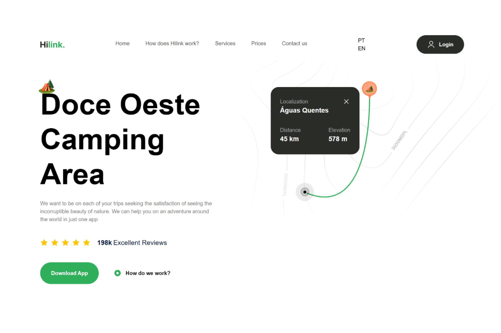

<h1 align="center">Hilink</h1>

<p align="center">
  
</p>


<br>

## 💻 Projeto

Hilink é um projeto de site desenvolvido através da aula do canal [JavaScript Mastery](https://www.youtube.com/@javascriptmastery) onde foi apresentado diversos conceitos a respeito do desenvolvimento web através do uso do NextJS 14 e Tailwind.
De minha parte resolvi acrescentar mais algumas coisas ao projeto como a responsividade do menu superior e a principal sendo a internacionalização do site nos idiomas Inglês e Português através do framework i18n.

## 🧪 Tecnologias

Esse projeto foi desenvolvido com as seguintes tecnolgias:

- [NextJS](https://nextjs.org/)
- [i18n](https://www.i18next.com/)
- [Tailwind](https://tailwindcss.com/)


## 🚀 Instalação

```bash
  # Clone o repositório e entre na pasta do projeto
  $ git clone https://github.com/AntDavi/travel_app
  # Instale as dependências
  $ yarn install
  # Execute a aplicação
  $ yarn run dev
```


## 📝 Licensa

Este projeto está licenciado sob a Licença MIT. Veja o arquivo [LICENSE](LICENSE) para obter mais detalhes.

---

<p align='center'>Criado by Anthony Davi 🙃</p>
